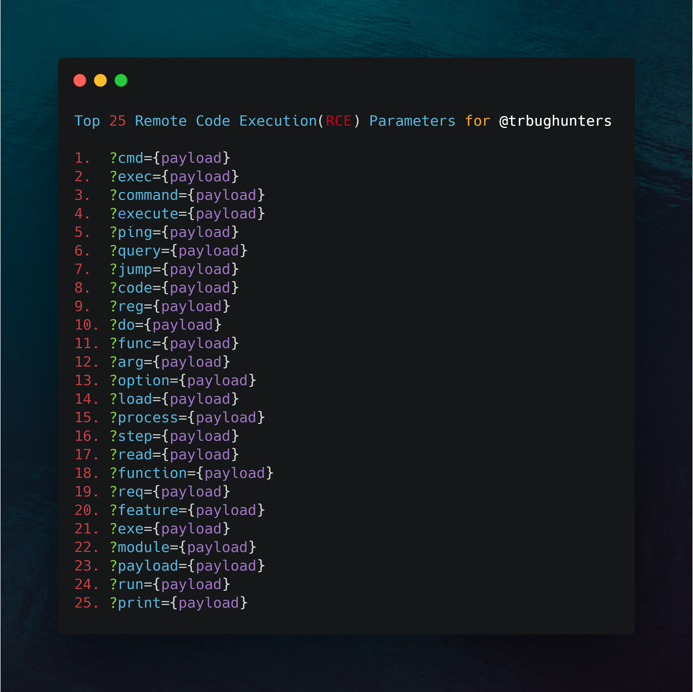

# OS Command Injection Vulnerability

## What is OS Command Injection 

- OS (Operating System) command injection is a critical vulnerability that occurs when an attacker is able to execute arbitrary commands on a target system through 
  a vulnerable application.

- This vulnerability typically arises in web applications, where user input is not properly validated or sanitized before being passed to system commands.

- That allows attackers to gain complete control over a web site and its underlying web server.

- OS command injection is also known as command injection or shell injection.

## How does OS command injection work?

- Most programming languages include functions that let the developer call operating system commands. The reasons for calling operating system commands are varied, for 
  example, to include functionality that is not available in that programming language by default, to call scripts written in other languages, and more.

- OS command injection vulnerabilities are a result of using such operating system call functions with insufficient input validation. A lack of validation enables the 
  attacker to inject malicious commands into user input and then execute them on the host operating system.

- Command injection vulnerabilities are a type of security issue that can occur in almost any kind of computer software.

  They can happen in many programming languages and on various platforms.

  For instance, you might find command injection vulnerabilities in embedded software used in routers, web applications or APIs made with PHP, server-side scripts created with Python, mobile apps built with Java, and even in essential parts of operating systems.

- The term OS command injection is defined in CWE-78 as "improper neutralization of special elements used in an OS command".

  OWASP prefers the simpler term "command injection". 

  The term shell injection is used very rarely. 
 
  Some OS command injection vulnerabilities are classified as "blind" or "out-of-band". This means that the OS command injection attack does not result in anything 
  being sent back or displayed immediately, and the result of the attack is, for example, sent to a server controlled by the attacker.

- Note that OS command injection is often confused with remote code execution (RCE), also known as "code injection".

  In the case of RCE, the attacker executes malicious code in the language of the application and within the application context.
 
  In the case of OS command injection, the attacker executes a malicious command in a system shell. 
 
  However, some sources consider OS command injection to be a type of code injection.

## Parameters 

- Here are the top 25 parameters that could be vulnerable to code injection and similar RCE vulnerabilities

## Command Injection Methods

- **Arbitrary command injection**: Some applications allow users to run arbitrary commands, executing them as-is on the underlying host.
  
- **Arbitrary file uploads**: Applications permitting uploads with arbitrary file extensions may inadvertently allow malicious commands. Placing such files in the webroot can result in command injection.
  
- **Insecure serialization**: Deserialization of user inputs without proper verification can lead to command injection.
  
- **Server-side template injection (SSTI)**: Attackers can insert malicious server-side templates into web applications, allowing remote code execution on the server.
  
- **XML external entity injection (XXE)**: Poorly-configured XML parsers parsing user-controlled XML input can lead to exposure of sensitive data, SSRF, or denial of service attacks.

## Command Injection Prevention

Here are several practices to prevent command injections:

- **Avoid system calls and user input**: Minimize the use of system calls that incorporate user input to prevent attackers from injecting characters into OS commands.

- **Set up input validation**: Implement thorough input validation to mitigate attacks like XSS and SQL Injection.

- **Create a whitelist**: Maintain a whitelist of acceptable inputs to ensure the system only accepts pre-approved inputs.

- **Use only secure APIs**: When executing system commands, utilize secure APIs such as execFile() to reduce the risk of command injection.

- **Securely use execFile()**: Prevent users from manipulating the program name and ensure that user input is mapped to command arguments securely, preventing direct execution of user input as commands.

## References

- [imperva](https://www.imperva.com/learn/application-security/command-injection/)

- [hacktricks](https://book.hacktricks.xyz/pentesting-web/command-injection)

- [PortSwigger](https://portswigger.net/kb/issues/00100100_os-command-injection)

- [invicti](https://www.invicti.com/learn/os-command-injection/)
